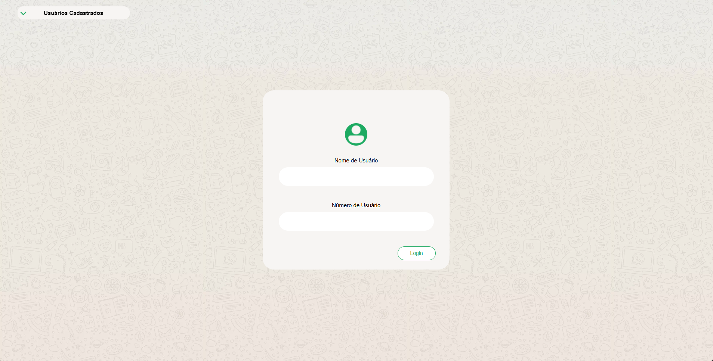
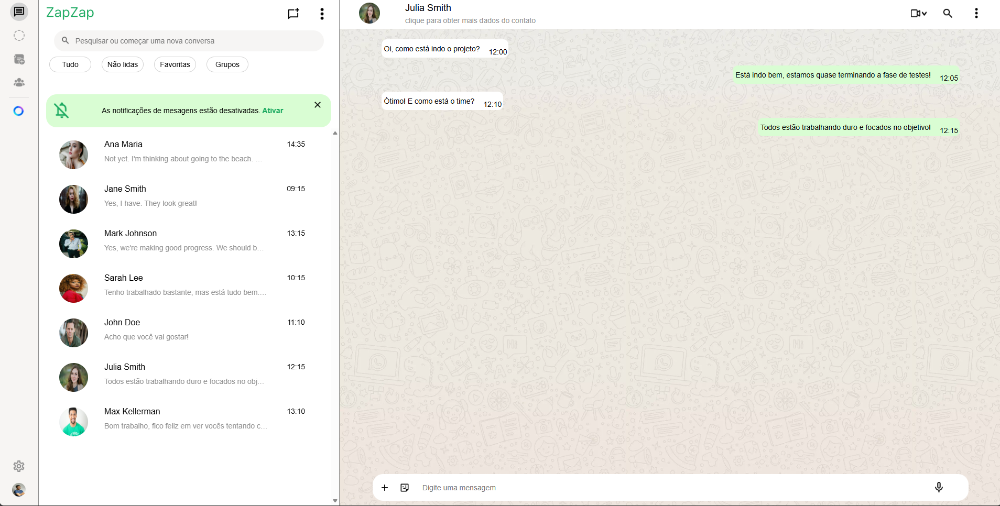

#  Zap-Zap
Um projeto web-site simples e interativo inspirado em aplicativos de mensagens. Assim como o WhatsApp Web, ele só pode ser acessado por dispostivos Desktop

## Layout para Desktop

Área de login de usuário

***


Conta do usuário logado

## Como executar localmente
1. **Clone este repositório:**
```command
git clone https://github.com/JoaoMoraes28/web-site_ZapZap.git
```
***
2. **Acesse a pasta do projeto:**
```command
cd web-site_ZapZap
```
***
3. **Execute o arquivo index.html com o Live Server no VS Code ou o próprio arquivo via navegador.**


## Tecnologias
* HTML
* CSS
* JavaScript
* [API própria - Fornecimento dos dados de usuários](https://github.com/JoaoMoraes28/API_zapZap)

### Contato
* joaovictor.moraes2728@gmail.com
* (11) 93203-1280
* [Linkedin](https://www.linkedin.com/in/jo%C3%A3o-victor-santos-de-moraes-0b6532270/)

---
_Projeto desenvolvido por João Victor Santos de Moraes_